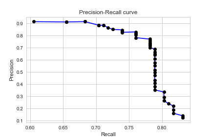

ReadMe Mod_5 Credit Card Fraud

Background: Credit card security is important to all concerned. Consumers are at risk for fraudulent transactions, merchants are often out of pocket for inventory and banks may be forced to credit vendors or consumers for losses. Investigating fraudulent and possible fraudulent transactions is an expense for the credit card issuers and a possible annoyance for consumers and merchants. Everyone has a vested interest in correctly identifying fraudulent credit card transactions so that they can be prevented. 

The data set consisted of 284,807 European credit card transactions over two days in September 2013 with 492 identified as fraudulent, making the data set highly unbalanced. The data includes the following features: class (fraud or valid transaction), amount of transaction, time of day in elapsed seconds since the start of the data set and 28 other variables that are not identified for confidentiality reasons. These masked variables have also been transformed using Principal Component Analysis. The currency is not identified. We have assumed it is Euros.

The data set is publicly available on kaggle. This model represents the work of Kelly Epley, Adam Blomfield, and Helen Levy-Myers.

Data Cleaning: Fortunately, this data set did not include any nulls or missing values. There were some duplicated rows and they were deleted. Time is converted to four time periods reflecting high transaction volume, low volume and shifting volume from low to high.

Exploratory Data Analysis: Time is one of the more interesting variables.The two days show a pattern of when transactions occurred. Assuming that Time began at midnight, there were some transactions until 1 am, then a significant lull until 7 am when again there is upward movement in the number of transactions. During the middle of the day the largest number of transactions occurred, then the amount declines until 1 am. 

The amount of fraudulent transactions were skewed towards low transaction amounts. Of the 492 fraudulent transactions, 25 had an amount of zero and an additional 41 less than one Euro. The chart below shows the pattern of transactions. 

Correlations and a heat map visualization were plotted. However, no correlations were discovered, possibly because the entire data set had already been transformed with PCA.

The Models Not Taken: The Kaggle description included several articles which were reviewed. They mentioned three machine learning models as most promising: logistic regression, SVM, and random forests. All three were tried. Logistic regression and SVM produced poor results; however, random forests produced very promising results. 

One model considered with random forests was to divide the data set into an amount above and below a certain threshold. The logic is that if it costs €75, for the sake of argument, to investigate a potential fraudulent transaction, the credit card issuer should focus its efforts on finding fraudulent transactions above that amount. To spend €75 investigating a €2.50 potential fraudulent transaction could cost the issuer more money than it is worth to block. Although this idea did produce very interesting results, it was rejected for two reasons. One, the quantity of fraudulent transactions was so small, that to lose just a few, even ones with small amounts was believed to harm the model. Two, 66 of the 492 identified frauds (or 13%) were less than €1 implying that fraudsters were testing the algorithms to see if there is a floor under which transactions were monitored with less vigilance. 

Random Forests: Random forests produced the best results. The goal in building the model is to identify the greatest number of frauds, true positives, while keeping the misidentified frauds, false positives, which annoy merchants and credit card holders, to a minimum. Because of this, the focus is on the precision-recall curve. 

The model uses grid search to tune the model and find out how many branches and how many sample splits that are optimal. Because the data set is so unbalanced, class weighting with the target variable is used to tune the model. Rather than simply oversampling with replacement of the fraud cases or undersampling the valid transactions to get a more balanced data set, SMOTE (Synthetic Minority Over-sampling Technique) is used. SMOTE creates new or synthetic data points for the smaller, minority part of the data set between the existing, real instances in the data set. It places these new data points on vectors between the existing minority instances. Cross validation is used to test the model. Results from the final confusion matrix showing the number of true positives (fraud cases, identified as fraud), true negatives (valid transactions, identified as valid), false positives (valid transactions identified as fraud) and false negative (fraud cases identified as valid transactions). The Precision-Recall curve plots these results. The best Precision-Recall curve shows the relationship between Precision, the ratio of true fraud cases to all the identified frauds, true and misidentified as fraud (TP/(TP+FP)). Recall shows the ratio between true fraud cases to all the fraud cases, true and those misidentified as valid TP/(TP+FN). 

The PR curve for this model shows how the precision and recall scores change as we adjust the probability threshold for a positive identification. The precision score dips when the number of false positives increases and the recall score dips when the number of false negatives increases. The more the curve hugs the upper right corner, the better the model does at correctly identifying true positives,  minimizing both false positives and false negatives.

 

